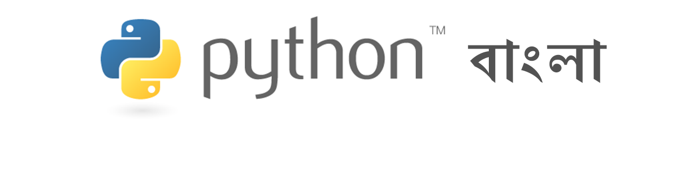

    

    
    
    
    
    

# Python, JavaScript and Computer Science

I created this repository to practice myself. Here I publish programming code for myself or for my tutorials published in my [Blog](https://thinkdiff.net) or my [Youtube Channel](https://www.youtube.com/channel/UCtHlgyUw0wLE5Ous9swfFlg). 

## My Open Source Projects

### React Native 
- [Todos Mobile App](https://github.com/mahmudahsan/todos-react-reactnative): cross platform mobile app with navigation and offline data storage

### React
- [Pythonbangla.com](https://github.com/mahmudahsan/python-bangla-react): Youtube video tutorials playlist in good shape.

### Python, Django
1. [Pythonbangla.com](https://github.com/mahmudahsan/pythonbangla.com): Youtube video tutorials playlist in good shape.
2. [Web Scraping](https://github.com/mahmudahsan/webscraping): alJazeera and goodreads website scraping techniques
3. [Bank Rates](https://github.com/mahmudahsan/bankrates): a Bangladeshi bank's currency rates scraping

## My Programming Courses and Tutorials

- [Learn Python Programming Full Course FREE](https://youtu.be/llbgjR_tL2k)
- [Master Python Programming in 5 Hours](https://www.udemy.com/python-beginner-to-advanced-with-web-scraping-projects/)
- [Web Scraping in Python with BeautifulSoup & Scrapy Framework](https://www.udemy.com/web-scraping-in-python/)
- [বাংলায় পাইথন প্রোগ্রামিং](https://pythonbangla.com)

### Python and JavaScript

1. [Coding Problems](coding-problems/)
2. [JavaScript Language](javascript/) 
3. [Design Patterns](design-patterns/)
4. [Python Language](python-language/) 
   

### Django

1. [Django Codes](django-framework/)
2. [Django Rest Framework Codes](django-rest-framework/)

